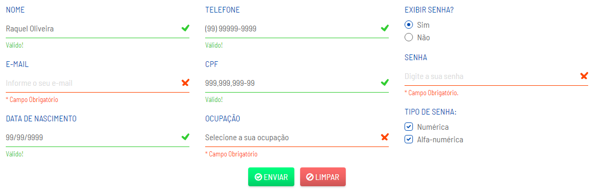

# Form -1-
> Formulário responsivo com validador de campos obrigatórios do Bootstrap 4 e máscaras nos campos numéricos.

#### Versões
                
+ [1.0](https://araquelos.github.io/form-1/form-1.0.html)
+ [1.1](https://araquelos.github.io/form-1/form-1.1.html)

#### Componentes
                
+ Form
    + HTML
    + CSS
    + JavaScript
    + Bootstrap